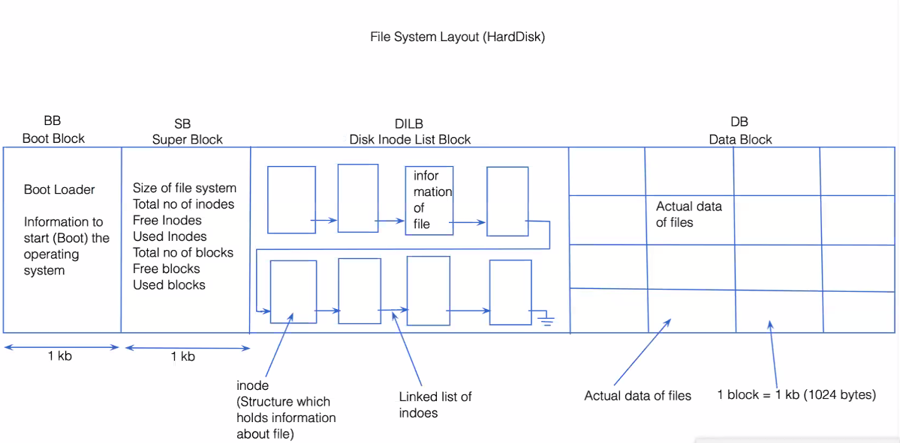

# Customized-Virtual-File-System
In this Project I create Virtual representation  of File System 

<h3 align="left">Programming Language</h3>

- To develop this project we select C Programming Language.
<h3 align="left">Operating System Used</h3> 

- As this Project execute on a primary storage i.e. RAM. their is no special requirements of an Operating System.
<h3 align="left">Description</h3> 

- In this project we emulate all data structure which are used by operating system to manage File system oriented task.

- As the name suggest its virtual because we maintain all record in Primary storage.

- In this Project we create all Data Structure which required for File Subsystem as Inode, Inode Table, File Table, UAREA, User File Descripter(UFDT), Super Block, Disk Inode List Block, Data Block, Boot Block etc.

- We Provide all implementation of necessary system call and commands of File subsystem as Open, Close, Read, Write, Lseek, Create, RM, LS, Stat, Fstat etc.

- WHile providing the implementations of all above functionality we use our own data structure by referring  Algorithms of UNNIX Operating System.

- By using this project we can get overview of UFS (UNIX File System) on any platform.

<h3 align="left">File System Layout On HARD DISK :</h3>

<h3 align="left">File System Layout On RAM :</h3>

